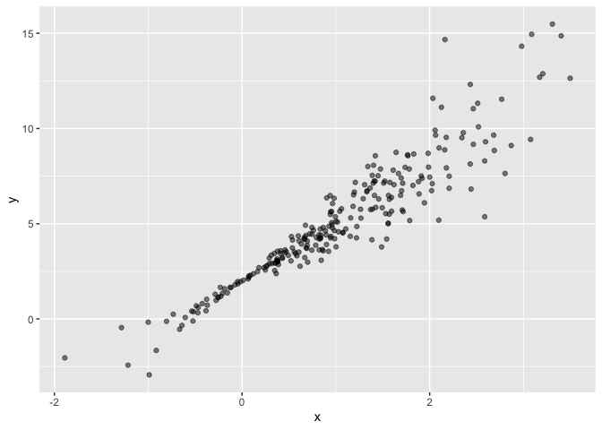
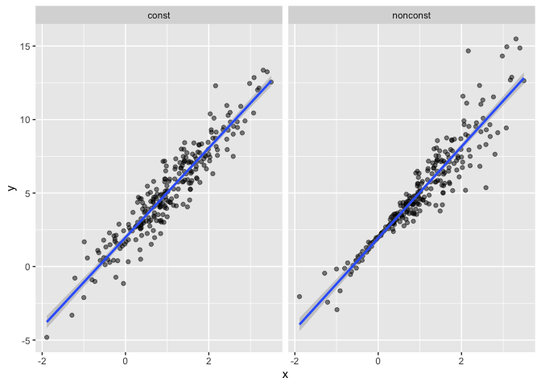
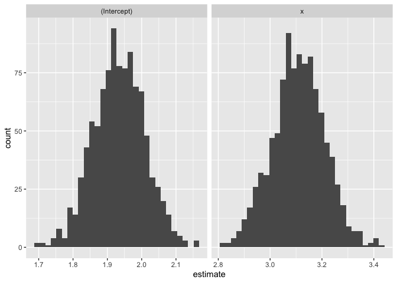
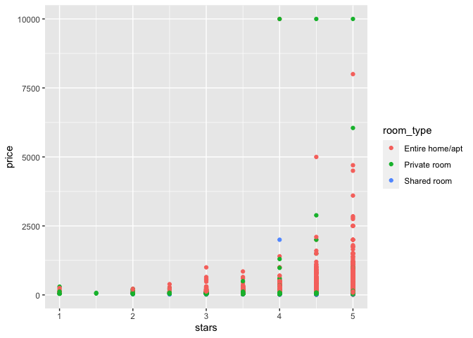
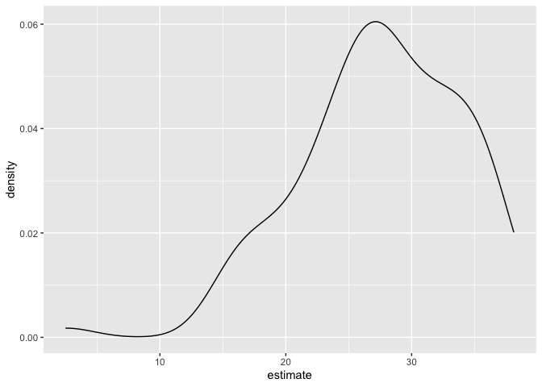
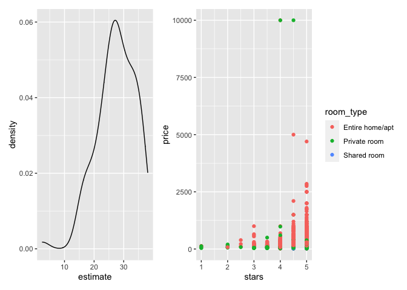

Bootstrapping
================

``` r
library(tidyverse)
```

    ## ── Attaching packages ─────────────────────────────────────── tidyverse 1.3.1 ──

    ## ✓ ggplot2 3.3.5     ✓ purrr   0.3.4
    ## ✓ tibble  3.1.6     ✓ dplyr   1.0.7
    ## ✓ tidyr   1.1.4     ✓ stringr 1.4.0
    ## ✓ readr   2.1.0     ✓ forcats 0.5.1

    ## ── Conflicts ────────────────────────────────────────── tidyverse_conflicts() ──
    ## x dplyr::filter() masks stats::filter()
    ## x dplyr::lag()    masks stats::lag()

``` r
library(p8105.datasets)

set.seed(1)
```

``` r
n_samp = 250

sim_df_const = 
  tibble(
    x = rnorm(n_samp, 1, 1),
    error = rnorm(n_samp, 0, 1),
    y = 2 + 3 * x + error
  )

sim_df_nonconst = sim_df_const %>% 
  mutate(
  error = error * .75 * x,
  y = 2 + 3 * x + error
)

sim_df_nonconst %>% 
  ggplot(aes(x = x, y = y)) + 
  geom_point(alpha = .5) 
```

<!-- -->

``` r
sim_df_nonconst %>% 
  lm(y ~x, data = .) %>% 
  broom:: tidy()
```

    ## # A tibble: 2 × 5
    ##   term        estimate std.error statistic   p.value
    ##   <chr>          <dbl>     <dbl>     <dbl>     <dbl>
    ## 1 (Intercept)     1.93    0.105       18.5 1.88e- 48
    ## 2 x               3.11    0.0747      41.7 5.76e-114

``` r
sim_df = 
  bind_rows(const = sim_df_const, nonconst = sim_df_nonconst, .id = "data_source") 

sim_df %>% 
  ggplot(aes(x = x, y = y)) + 
  geom_point(alpha = .5) +
  stat_smooth(method = "lm") +
  facet_grid(~data_source) 
```

    ## `geom_smooth()` using formula 'y ~ x'

<!-- -->

## Drawing one bootstrap sample

``` r
bootstrap = 
sim_df_nonconst %>% 
  sample_frac(size =1, replace = TRUE) %>% 
  arrange(x)

lm(y~x, data = bootstrap)
```

    ## 
    ## Call:
    ## lm(formula = y ~ x, data = bootstrap)
    ## 
    ## Coefficients:
    ## (Intercept)            x  
    ##       1.897        3.196

Let’s write function

``` r
boot_sample = function(df) {
  sample_frac(df, size = 1, replace = TRUE)
}
```

Now, make a tibble to keep track evertything

``` r
boot_strap_df = 
  tibble(strap_number = 1:1000,
         strap_sample = rerun(1000, boot_sample(sim_df_nonconst)))
```

``` r
boot_strap_df %>% 
  filter(strap_number %in% 1:2) %>% 
  mutate(strap_sample = map(strap_sample, ~arrange(.x, x))) %>% 
  pull(strap_sample)
```

    ## [[1]]
    ## # A tibble: 250 × 3
    ##         x   error       y
    ##     <dbl>   <dbl>   <dbl>
    ##  1 -1.89   1.62   -2.04  
    ##  2 -1.89   1.62   -2.04  
    ##  3 -1.21  -0.781  -2.43  
    ##  4 -1.21  -0.781  -2.43  
    ##  5 -1.00   0.832  -0.169 
    ##  6 -0.989 -1.97   -2.93  
    ##  7 -0.914 -0.908  -1.65  
    ##  8 -0.606 -0.106   0.0774
    ##  9 -0.536  0.0227  0.413 
    ## 10 -0.524 -0.536  -0.106 
    ## # … with 240 more rows
    ## 
    ## [[2]]
    ## # A tibble: 250 × 3
    ##         x  error       y
    ##     <dbl>  <dbl>   <dbl>
    ##  1 -1.29   1.40  -0.454 
    ##  2 -0.989 -1.97  -2.93  
    ##  3 -0.914 -0.908 -1.65  
    ##  4 -0.914 -0.908 -1.65  
    ##  5 -0.805  0.292 -0.123 
    ##  6 -0.805  0.292 -0.123 
    ##  7 -0.665 -0.544 -0.539 
    ##  8 -0.641 -0.416 -0.338 
    ##  9 -0.606 -0.106  0.0774
    ## 10 -0.606 -0.106  0.0774
    ## # … with 240 more rows

``` r
bootstrap_results = 
  boot_strap_df %>% 
  mutate(
    models = map(strap_sample, ~lm(y ~ x, data = .x) ),
    results = map(models, broom::tidy)) %>% 
  select(-strap_sample, -models) %>% 
  unnest(results) 

bootstrap_results %>% 
  ggplot(aes(x = estimate)) +
  geom_histogram() +
  facet_grid(~term, scales = "free")
```

    ## `stat_bin()` using `bins = 30`. Pick better value with `binwidth`.

<!-- -->

``` r
lm(y~x, data = sim_df_nonconst) %>% 
  broom::tidy()
```

    ## # A tibble: 2 × 5
    ##   term        estimate std.error statistic   p.value
    ##   <chr>          <dbl>     <dbl>     <dbl>     <dbl>
    ## 1 (Intercept)     1.93    0.105       18.5 1.88e- 48
    ## 2 x               3.11    0.0747      41.7 5.76e-114

``` r
bootstrap_results %>% 
  group_by(term) %>% 
  summarise(
    se = sd(estimate)
  )
```

    ## # A tibble: 2 × 2
    ##   term            se
    ##   <chr>        <dbl>
    ## 1 (Intercept) 0.0747
    ## 2 x           0.101

## Use `modelr`

``` r
boot_straps = 
  sim_df_nonconst %>% 
  modelr::bootstrap(n = 1000) 

boot_straps$strap[[1]]
```

    ## <resample [250 x 3]> 8, 132, 69, 225, 180, 122, 34, 170, 216, 122, ...

## airbnb data

``` r
data("nyc_airbnb")

nyc_airbnb = 
  nyc_airbnb %>% 
  mutate(stars = review_scores_location / 2) %>% 
  rename(
    boro = neighbourhood_group,
    neighborhood = neighbourhood) %>% 
  filter(boro != "Staten Island") %>% 
  select(price, stars, boro, neighborhood, room_type)
```

``` r
nyc_airbnb %>% 
  ggplot(aes(x = stars, y = price, color = room_type)) + 
  geom_point() 
```

    ## Warning: Removed 9962 rows containing missing values (geom_point).

<!-- -->

bootstrap

``` r
boot_result=
nyc_airbnb %>% 
  filter(boro == "Manhattan") %>% 
  modelr::bootstrap(n = 100, id="strap_number") %>% 
  mutate(
    models = map(strap, ~ lm(price ~ stars + room_type, data = .x)),
    results = map(models, broom::tidy)) %>% 
  select(results,strap_number) %>% 
  unnest(results)

boot_result %>% 
  filter(term == "stars") %>% 
  ggplot(aes(x = estimate)) + geom_density()
```

<!-- -->

``` r
library(patchwork)

ggp_star_est = 
boot_result %>% 
  filter(term == "stars") %>% 
  ggplot(aes(x = estimate)) + geom_density()

ggp_scatter =
nyc_airbnb %>% 
  filter(boro == "Manhattan") %>% 
  ggplot(aes(x = stars, y = price, color = room_type)) + 
  geom_point() 
  
ggp_star_est + ggp_scatter
```

    ## Warning: Removed 4671 rows containing missing values (geom_point).

<!-- -->
