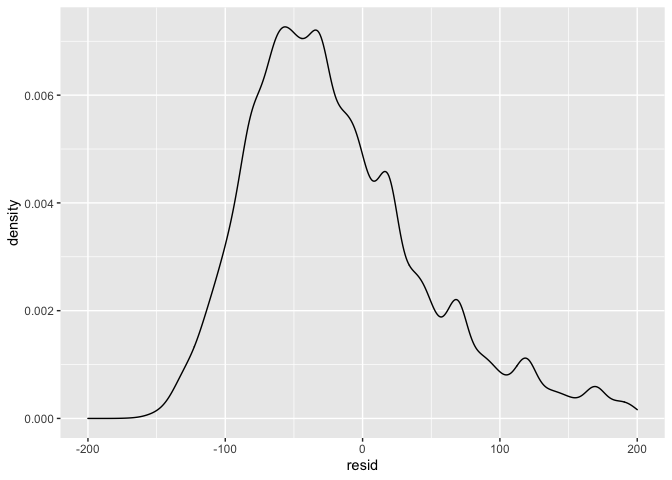
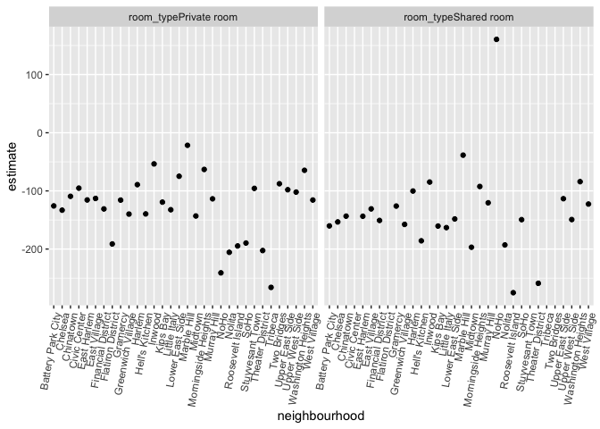

linear_models
================
Yang Gao

``` r
library(tidyverse)
```

    ## ── Attaching packages ─────────────────────────────────────── tidyverse 1.3.1 ──

    ## ✓ ggplot2 3.3.5     ✓ purrr   0.3.4
    ## ✓ tibble  3.1.6     ✓ dplyr   1.0.7
    ## ✓ tidyr   1.1.4     ✓ stringr 1.4.0
    ## ✓ readr   2.1.0     ✓ forcats 0.5.1

    ## ── Conflicts ────────────────────────────────────────── tidyverse_conflicts() ──
    ## x dplyr::filter() masks stats::filter()
    ## x dplyr::lag()    masks stats::lag()

``` r
library(p8105.datasets)

set.seed(1)
```

load NYC Airbnb data

``` r
data("nyc_airbnb")

nyc_airbnb = 
  nyc_airbnb %>% 
  mutate (stars = review_scores_location / 2) %>% 
  rename(boro = neighbourhood_group)%>% 
  filter(boro != "Staten Island") %>% 
  select(price, stars, boro, neighbourhood, room_type)
```

linear model:`price` as an outcome that may depend on rating and borough

``` r
fit = lm(price ~ stars + boro, data = nyc_airbnb)
```

``` r
summary(fit)
```

    ## 
    ## Call:
    ## lm(formula = price ~ stars + boro, data = nyc_airbnb)
    ## 
    ## Residuals:
    ##    Min     1Q Median     3Q    Max 
    ## -169.8  -64.0  -29.0   20.2 9870.0 
    ## 
    ## Coefficients:
    ##               Estimate Std. Error t value Pr(>|t|)    
    ## (Intercept)    -70.414     14.021  -5.022 5.14e-07 ***
    ## stars           31.990      2.527  12.657  < 2e-16 ***
    ## boroBrooklyn    40.500      8.559   4.732 2.23e-06 ***
    ## boroManhattan   90.254      8.567  10.534  < 2e-16 ***
    ## boroQueens      13.206      9.065   1.457    0.145    
    ## ---
    ## Signif. codes:  0 '***' 0.001 '**' 0.01 '*' 0.05 '.' 0.1 ' ' 1
    ## 
    ## Residual standard error: 181.5 on 30525 degrees of freedom
    ##   (9962 observations deleted due to missingness)
    ## Multiple R-squared:  0.03423,    Adjusted R-squared:  0.03411 
    ## F-statistic: 270.5 on 4 and 30525 DF,  p-value: < 2.2e-16

``` r
summary(fit)$coef
```

    ##                Estimate Std. Error   t value     Pr(>|t|)
    ## (Intercept)   -70.41446  14.020697 -5.022180 5.137589e-07
    ## stars          31.98989   2.527500 12.656733 1.269392e-36
    ## boroBrooklyn   40.50030   8.558724  4.732049 2.232595e-06
    ## boroManhattan  90.25393   8.567490 10.534465 6.638618e-26
    ## boroQueens     13.20617   9.064879  1.456850 1.451682e-01

changing reference group using `fct_infreq`

``` r
nyc_airbnb = 
  nyc_airbnb %>% 
  mutate(
    boro = fct_infreq(boro),
    room_type = fct_infreq(room_type))

fit_2 = lm(price ~ stars + boro, data = nyc_airbnb)

summary(fit_2)$coef
```

    ##               Estimate Std. Error    t value      Pr(>|t|)
    ## (Intercept)   19.83946  12.189256   1.627619  1.036160e-01
    ## stars         31.98989   2.527500  12.656733  1.269392e-36
    ## boroBrooklyn -49.75363   2.234878 -22.262345 6.317605e-109
    ## boroQueens   -77.04776   3.726632 -20.674904  2.584908e-94
    ## boroBronx    -90.25393   8.567490 -10.534465  6.638618e-26

``` r
fit %>% 
  broom::tidy() %>% 
  select(term, estimate, p.value) %>% 
  mutate(term = str_replace(term, "^boro", "Borough: ")) %>% 
  knitr::kable(digits = 3)
```

| term               | estimate | p.value |
|:-------------------|---------:|--------:|
| (Intercept)        |  -70.414 |   0.000 |
| stars              |   31.990 |   0.000 |
| Borough: Brooklyn  |   40.500 |   0.000 |
| Borough: Manhattan |   90.254 |   0.000 |
| Borough: Queens    |   13.206 |   0.145 |

Diagnostics

``` r
modelr::add_residuals(nyc_airbnb, fit) %>% 
  ggplot(aes(x = resid)) +
  geom_density() +
  xlim (-200,200)
```

    ## Warning: Removed 11208 rows containing non-finite values (stat_density).

<!-- -->

``` r
fit = lm(price ~ stars + room_type, data = nyc_airbnb)

broom::tidy(fit) 
```

    ## # A tibble: 4 × 5
    ##   term                  estimate std.error statistic   p.value
    ##   <chr>                    <dbl>     <dbl>     <dbl>     <dbl>
    ## 1 (Intercept)               51.4     11.5       4.46 8.25e-  6
    ## 2 stars                     30.6      2.41     12.7  8.00e- 37
    ## 3 room_typePrivate room   -111.       2.05    -54.1  0        
    ## 4 room_typeShared room    -132.       6.18    -21.3  3.11e-100

let’s try nesting

``` r
nyc_airbnb %>% 
  relocate(boro) %>% 
  nest(data = price:room_type) %>% 
  mutate(
    lm_fits = map(data, ~lm(price ~ stars + room_type, data =.x)),
    lm_results = map(lm_fits, broom::tidy)
  ) %>% 
  select(boro, lm_results)
```

    ## # A tibble: 4 × 2
    ##   boro      lm_results      
    ##   <fct>     <list>          
    ## 1 Bronx     <tibble [4 × 5]>
    ## 2 Queens    <tibble [4 × 5]>
    ## 3 Brooklyn  <tibble [4 × 5]>
    ## 4 Manhattan <tibble [4 × 5]>

``` r
manhattan_airbnb =
  nyc_airbnb %>% 
  filter(boro == "Manhattan")

manhattan_nest_lm_res =
  manhattan_airbnb %>% 
  nest(data = -neighbourhood) %>% 
  mutate(
    models = map(.x = data, ~lm(price ~ stars + room_type, data = .x)),
    results = map(models, broom::tidy)) %>% 
  select(-data, -models) %>% 
  unnest(results)
```

``` r
manhattan_nest_lm_res %>% 
  filter ( term =="stars") %>% 
  ggplot ( aes(x = estimate)) + 
  geom_density()
```

<!-- -->

``` r
manhattan_nest_lm_res %>% 
  filter(str_detect(term, "room_type")) %>% 
  ggplot(aes(x = neighbourhood, y = estimate)) + 
  geom_point() + 
  facet_wrap(~term) + 
  theme(axis.text.x = element_text(angle = 80, hjust = 1))
```

<!-- -->

``` r
new_nyc_airbnb = nyc_airbnb %>% 
  mutate(expensive_apt = as.numeric(price > 500)) 
```

``` r
logistic_fit = 
  glm (
    expensive_apt ~ stars + boro,
    data = new_nyc_airbnb,
    family = binomial())

logistic_fit %>% 
  broom::tidy() %>% 
  mutate(
    term = str_replace(term, "boro","Boro: "),
    estimate = exp(estimate)
  ) %>% 
  select(term, OR = estimate, p.value)
```

    ## # A tibble: 5 × 3
    ##   term                   OR  p.value
    ##   <chr>               <dbl>    <dbl>
    ## 1 (Intercept)    0.000610   1.41e-20
    ## 2 stars          2.15       2.92e- 6
    ## 3 Boro: Brooklyn 0.307      3.94e-22
    ## 4 Boro: Queens   0.142      7.85e- 9
    ## 5 Boro: Bronx    0.00000123 9.40e- 1

``` r
new_nyc_airbnb %>% 
  modelr::add_predictions(logistic_fit) %>% 
  mutate (pred = boot::inv.logit(pred))
```

    ## # A tibble: 40,492 × 7
    ##    price stars boro  neighbourhood room_type       expensive_apt          pred
    ##    <dbl> <dbl> <fct> <chr>         <fct>                   <dbl>         <dbl>
    ##  1    99   5   Bronx City Island   Private room                0  0.0000000343
    ##  2   200  NA   Bronx City Island   Private room                0 NA           
    ##  3   300  NA   Bronx City Island   Entire home/apt             0 NA           
    ##  4   125   5   Bronx City Island   Entire home/apt             0  0.0000000343
    ##  5    69   5   Bronx City Island   Private room                0  0.0000000343
    ##  6   125   5   Bronx City Island   Entire home/apt             0  0.0000000343
    ##  7    85   5   Bronx City Island   Entire home/apt             0  0.0000000343
    ##  8    39   4.5 Bronx Allerton      Private room                0  0.0000000234
    ##  9    95   5   Bronx Allerton      Entire home/apt             0  0.0000000343
    ## 10   125   4.5 Bronx Allerton      Entire home/apt             0  0.0000000234
    ## # … with 40,482 more rows
